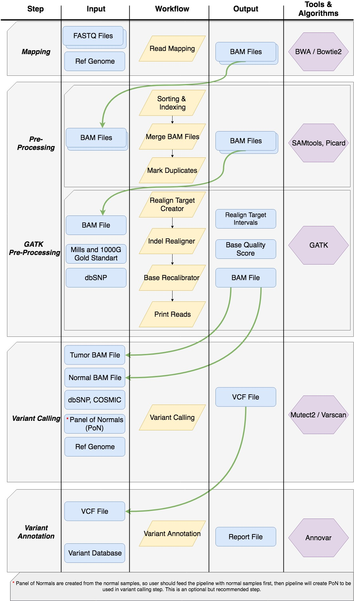

# Genomics Pipeline

### Overview

Genomic Pipeline is a software used for analyzing DNA sequence data.

 Our pipeline provides multiple algorithms for every step of sequencing analyses and allows user to compare these alternative algorithms by intermediary outputs. It starts from a raw FASTQ file (which is the text file produced by sequencing machines) and ends with a VCF and TXT files (detailed files of discovered SNPs/Indels). It includes different types of mapping, pre-processing (such as GATK Best Practices), variant calling and variant annotation algorithms. A very brief workflow of our basic pipeline can be seen in below figure. 




## Getting Started
### Prerequisites
* UNIX/Linux
* Python 3 or higher
* Java 
* <a href="https://broadinstitute.github.io/picard">Picard</a>
* <a href="https://software.broadinstitute.org/gatk/documentation/quickstart">GenomeAnalysisToolkit (GATK 3.5-0)</a>
* <a href="https://sourceforge.net/projects/varscan/files/">VarScan.v2.3.9</a>
* <a href="http://htslib.org/download">Samtools</a>
* <a href="http://annovar.openbioinformatics.org/en/latest/">Annovar</a>

### Getting your clone
```
$git clone https://github.com/MBaysanLab/GenomicPipeline
```
If you do not have git you can download zipped Genomic Pipeline <a href="https://github.com/MBaysanLab/GenomicPipeline/archive/master.zip">here.</a>

### Files

If input files are tumor sample, FASTQ file must be gzipped and following convention;
SampleName_SampleNumber_Lane_Read_FlowCellIndex.fastq.gz (i.e. SN01_AACGTGA_L001_R1_001.fastq.gz).

If input files are normal sample, FASTQ file must be gzipped and following convention;
SampleName_Germline_SampleNumber_Lane_Read_FlowCellIndex.fastq.gz (i.e. SN02_Germline_ACGGTGA_L001_R1_001.fastq.gz).

### Usage
After you install relative tools and add them to your system path, you must to edit path.py file with corresponding directories.

Pipeline is divided to 2 independent sub-pipeline; 
* One for mapping and pre-processing. For this pipeline you just need to edit main function of run_pipeline_mapping.py file.
  * Then run the python file in an ide or write below command
    ```
    python run_pipeline_mapping.py
    ```
    

* Second is variant calling and variant annotation. For this pipeline you just need to edit main function of run_pipeline_variant_calling.py file
    * Then run the python file in an ide or write below command
        ```
        python run_pipeline_variant_calling.py
        ```
    
You can now
* Map each samples and align them to according reference genome with BWA and Bowtie2 algorithms
* Make pre process steps for variant calling with SAMTools and GATK Best Practices
* Variant call with tumor and normal sample in order to find mutations and variants on sample with Varscan and Mutect2.
* Annotate variants and  find mutations in corresponding genes, past studies and get statistic for them with Annovar.


## Important Notes 

When start to use pipeline, map your germline/normal samples before than tumor files because you will need output of the germline and tumor files in variant calling together.
 

### Contact

If you have questions or need help using the pipeline you can contact us via <a href="mailto:sahinsarihan@std.sehir.edu.tr?Subject=Genomics%20Pipeline" target="_top">e-mail</a>
